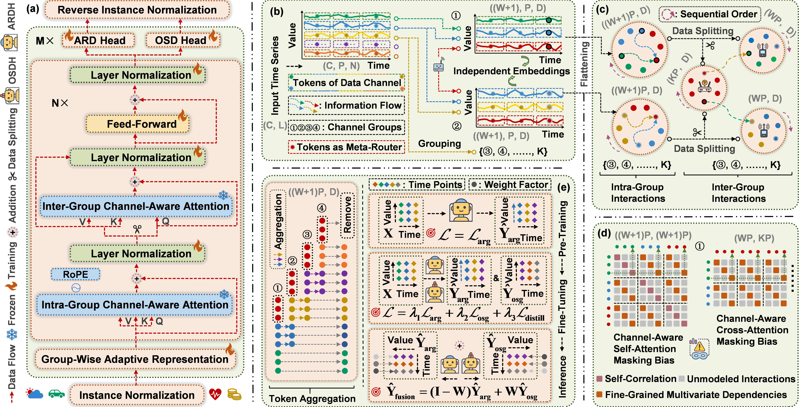

# TimeCAP: A Channel-Aware Pre-Training Framework for Multivariate Time Series Forecasting
TimeCAP introduces the first purely channel-aware pre-training framework for multivariate time series and systematically integrates the complementary advantages of autoregressive and one-shot generative paradigms. This design establishes a new modeling perspective for future time series foundation models by explicitly capturing inter-channel dependencies during pre-training rather than treating channels as independent signals.

This repository corresponds to the official implementation of the AAAI 2026 paper “TimeCAP: A Channel-Aware Pre-Training Framework for Multivariate Time Series Forecasting.” 

  

